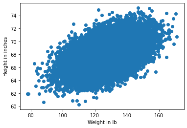
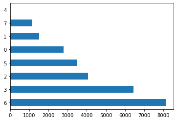
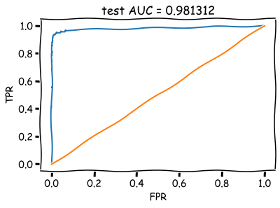

    
**<center>[mlcourse.ai](https://mlcourse.ai) – Open Machine Learning Course** </center><br>

Author: [Yury Kashnitskiy](https://yorko.github.io). Translated and edited by [Serge Oreshkov](https://www.linkedin.com/in/sergeoreshkov/), and [Yuanyuan Pao](https://www.linkedin.com/in/yuanyuanpao/). This material is subject to the terms and conditions of the [Creative Commons CC BY-NC-SA 4.0](https://creativecommons.org/licenses/by-nc-sa/4.0/) license. Free use is permitted for any non-commercial purpose.

# <center>Topic 8. Vowpal Wabbit: Learning with Gigabytes of Data</center><a class="tocSkip">

This week, we’ll cover two reasons for Vowpal Wabbit’s exceptional training speed, namely, online learning and hashing trick, in both theory and practice. We will try it out with news, movie reviews, and StackOverflow questions.

# Outline
1. [Stochastic gradient descent and online learning](#1.-Stochastic-gradient-descent-and-online-learning)
    - 1.1. [SGD](#1.1.-Stochastic-gradient-descent)
    - 1.2. [Online approach to learning](#1.2.-Online-approach-to-learning)
2. [Categorical feature processing](#2.-Categorical-feature-processing)
    - 2.1. [Label Encoding](#2.1.-Label-Encoding)
    - 2.2. [One-Hot Encoding](#2.2.-One-Hot-Encoding)
    - 2.3. [Hashing trick](#2.3.-Hashing-trick)
3. [Vowpal Wabbit](#3.-Vowpal-Wabbit)
    - 3.1. [News. Binary classification](#3.1.-News.-Binary-classification)
    - 3.2. [News. Multiclass classification](#3.2.-News.-Multiclass-classification)
    - 3.3. [IMDB movie reviews](#3.3.-IMDB-movie-reviews)
    - 3.4. [Classifying gigabytes of StackOverflow questions](#3.4.-Classifying-gigabytes-of-StackOverflow-questions)
4. [Demo assignment](#4.-Demo-assignment)
5. [Useful resources](#5.-Useful-resources)


```{code-cell} ipython3
import os
import re
import warnings

import matplotlib.pyplot as plt
import numpy as np
import pandas as pd
from scipy.sparse import csr_matrix
from sklearn.datasets import fetch_20newsgroups, load_files
from sklearn.linear_model import LogisticRegression
from sklearn.metrics import (accuracy_score, classification_report,
                             confusion_matrix, log_loss, roc_auc_score,
                             roc_curve)
from sklearn.model_selection import train_test_split
from sklearn.preprocessing import LabelEncoder, OneHotEncoder
from tqdm import tqdm_notebook

%matplotlib inline
import seaborn as sns
```


```{code-cell} ipython3
warnings.filterwarnings("ignore")
```

## 1. Stochastic gradient descent and online learning
###  1.1. Stochastic gradient descent

Despite the fact that gradient descent is one of the first things learned in machine learning and optimization courses, it is one of its modifications, Stochastic Gradient Descent (SGD), that is hard to top.

Recall that the idea of gradient descent is to minimize some function by making small steps in the direction of the fastest decrease. This method was named due to the following fact from calculus: vector $\nabla f = (\frac{\partial f}{\partial x_1}, \ldots \frac{\partial f}{\partial x_n})^\text{T}$ of partial derivatives of the function $f(x) = f(x_1, \ldots x_n)$ points to the direction of the fastest function growth. It means that, by moving in the opposite direction (antigradient), it is possible to decrease the function value with the fastest rate.


Here is a snowboarder (me) in Sheregesh, Russia's most popular winter resort. (I highly recommended it if you like skiing or snowboarding). In addition to advertising the beautiful landscapes, this picture depicts the idea of gradient descent. If you want to ride as fast as possible, you need to choose the path of steepest descent. Calculating antigradients can be seen as evaluating the slope at various spots.

**Example**

The paired regression problem can be solved with gradient descent. Let us predict one variable using another: height with weight. Assume that these variables are linearly dependent. We will use the [SOCR](http://wiki.stat.ucla.edu/socr/index.php/SOCR_Data) dataset. 


```{code-cell} ipython3
# for Jupyter-book, we copy data from GitHub, locally, to save Internet traffic,
# you can specify the data/ folder from the root of your cloned 
# https://github.com/Yorko/mlcourse.ai repo, to save Internet traffic
DATA_PATH = "https://raw.githubusercontent.com/Yorko/mlcourse.ai/master/data/"
```


```{code-cell} ipython3
PATH_TO_WRITE_DATA = "../../tmp/"
data_demo = pd.read_csv(os.path.join(DATA_PATH, "weights_heights.csv"))
```


```{code-cell} ipython3
plt.scatter(data_demo["Weight"], data_demo["Height"])
plt.xlabel("Weight in lb")
plt.ylabel("Height in inches");
```


    

    


Here we have a vector $x$ of dimension $\ell$ (weight of every person i.e. training sample) and $y$, a vector containing the height of every person in the dataset. 

The task is the following: find weights $w_0$ and $w_1$ such that predicting height as $y_i = w_0 + w_1 x_i$ (where $y_i$ is $i$-th height value, $x_i$ is $i$-th weight value) minimizes the squared error (as well as mean squared error since $\frac{1}{\ell}$ doesn't make any difference ):
$$SE(w_0, w_1) = \frac{1}{2}\sum_{i=1}^\ell(y_i - (w_0 + w_1x_{i}))^2 \rightarrow min_{w_0,w_1}$$

We will use gradient descent, utilizing the partial derivatives of $SE(w_0, w_1)$ over weights $w_0$ and $w_1$.
An iterative training procedure is then defined by simple update formulas (we change model weights in small steps, proportional to a small constant $\eta$, towards the antigradient of the function $SE(w_0, w_1)$):

$$\begin{array}{rcl} w_0^{(t+1)} = w_0^{(t)} -\eta \frac{\partial SE}{\partial w_0} |_{t} \\  w_1^{(t+1)} = w_1^{(t)} -\eta \frac{\partial SE}{\partial w_1} |_{t} \end{array}$$

Computing the partial derivatives, we get the following: 

$$\begin{array}{rcl} w_0^{(t+1)} = w_0^{(t)} + \eta \sum_{i=1}^{\ell}(y_i - w_0^{(t)} - w_1^{(t)}x_i) \\  w_1^{(t+1)} = w_1^{(t)} + \eta \sum_{i=1}^{\ell}(y_i - w_0^{(t)} - w_1^{(t)}x_i)x_i \end{array}$$

This math works quite well as long as the amount of data is not large (we will not discuss issues with local minima, saddle points, choosing the learning rate, moments and other stuff –- these topics are covered very thoroughly in [the Numeric Computation chapter](http://www.deeplearningbook.org/contents/numerical.html) in "Deep Learning"). 
There is an issue with batch gradient descent -- the gradient evaluation requires the summation of a number of values for every object from the training set. In other words, the algorithm requires a lot of iterations, and every iteration recomputes weights with formula which contains a sum $\sum_{i=1}^\ell$ over the whole training set. What happens when we have billions of training samples?


Hence the motivation for stochastic gradient descent! Simply put, we throw away the summation sign and update the weights only over single training samples (or a small number of them). In our case, we have the following:

$$\begin{array}{rcl} w_0^{(t+1)} = w_0^{(t)} + \eta (y_i - w_0^{(t)} - w_1^{(t)}x_i) \\  w_1^{(t+1)} = w_1^{(t)} + \eta (y_i - w_0^{(t)} - w_1^{(t)}x_i)x_i \end{array}$$

With this approach, there is no guarantee that we will move in best possible direction at every iteration. Therefore, we may need many more iterations, but we get much faster weight updates.

Andrew Ng has a good illustration of this in his [machine learning course](https://www.coursera.org/learn/machine-learning). Let's take a look.


These are the contour plots for some function, and we want to find the global minimum of this function. The red curve shows weight changes (in this picture, $\theta_0$ and $\theta_1$ correspond to our $w_0$ and $w_1$). According to the properties of a gradient, the direction of change at every point is orthogonal to contour plots. With stochastic gradient descent, weights are changing in a less predictable manner, and it even may seem that some steps are wrong by leading away from minima; however, both procedures converge to the same solution.

### 1.2. Online approach to learning
Stochastic gradient descent gives us practical guidance for training both classifiers and regressors with large amounts of data up to hundreds of GBs (depending on computational resources).

Considering the case of paired regression, we can store the training data set $(X,y)$ in HDD without loading it into RAM (where it simply won't fit), read objects one by one, and update the weights of our model:

$$\begin{array}{rcl} w_0^{(t+1)} = w_0^{(t)} + \eta (y_i - w_0^{(t)} - w_1^{(t)}x_i) \\  w_1^{(t+1)} = w_1^{(t)} + \eta (y_i - w_0^{(t)} - w_1^{(t)}x_i)x_i \end{array}$$

After working through the whole training dataset, our loss function (for example, quadratic squared root error in regression or logistic loss in classification) will decrease, but it usually takes dozens of passes over the training set to make the loss small enough. 

This approach to learning is called **online learning**, and this name emerged even before machine learning MOOC-s turned mainstream.

We did not discuss many specifics about SGD here. If you want dive into theory, I highly recommend ["Convex Optimization" by Stephen Boyd](https://www.amazon.com/Convex-Optimization-Stephen-Boyd/dp/0521833787). Now, we will introduce the Vowpal Wabbit library, which is good for training simple models with huge data sets thanks to stochastic optimization and another trick, feature hashing.

In scikit-learn, classifiers and regressors trained with SGD are named  `SGDClassifier` and `SGDRegressor` in `sklearn.linear_model`. These are nice implementations of SGD, but we'll focus on VW since it is more performant than sklearn's SGD models in many aspects.

## 2. Categorical feature processing

### 2.1. Label Encoding
Many classification and regression algorithms operate in Euclidean or metric space, implying that data is represented with vectors of real numbers. However, in real data, we often have categorical features with discrete values such as yes/no or January/February/.../December. We will see how to process this kind of data, particularly with linear models, and how to deal with many categorical features even when they have many unique values.

Let's explore the [UCI bank marketing dataset](https://archive.ics.uci.edu/ml/datasets/bank+marketing) where most of  features are categorical.


```{code-cell} ipython3
df = pd.read_csv(os.path.join(DATA_PATH, "bank_train.csv"))
labels = pd.read_csv(
    os.path.join(DATA_PATH, "bank_train_target.csv"), header=None
)

df.head()
```


<div>
<style scoped>
    .dataframe tbody tr th:only-of-type {
        vertical-align: middle;
    }

    .dataframe tbody tr th {
        vertical-align: top;
    }

    .dataframe thead th {
        text-align: right;
    }
</style>
<table border="1" class="dataframe">
  <thead>
    <tr style="text-align: right;">
      <th></th>
      <th>age</th>
      <th>job</th>
      <th>marital</th>
      <th>education</th>
      <th>default</th>
      <th>housing</th>
      <th>loan</th>
      <th>contact</th>
      <th>month</th>
      <th>day_of_week</th>
      <th>duration</th>
      <th>campaign</th>
      <th>pdays</th>
      <th>previous</th>
      <th>poutcome</th>
      <th>emp.var.rate</th>
      <th>cons.price.idx</th>
      <th>cons.conf.idx</th>
      <th>euribor3m</th>
      <th>nr.employed</th>
    </tr>
  </thead>
  <tbody>
    <tr>
      <th>0</th>
      <td>26</td>
      <td>student</td>
      <td>single</td>
      <td>high.school</td>
      <td>no</td>
      <td>no</td>
      <td>no</td>
      <td>telephone</td>
      <td>jun</td>
      <td>mon</td>
      <td>901</td>
      <td>1</td>
      <td>999</td>
      <td>0</td>
      <td>nonexistent</td>
      <td>1.4</td>
      <td>94.465</td>
      <td>-41.8</td>
      <td>4.961</td>
      <td>5228.1</td>
    </tr>
    <tr>
      <th>1</th>
      <td>46</td>
      <td>admin.</td>
      <td>married</td>
      <td>university.degree</td>
      <td>no</td>
      <td>yes</td>
      <td>no</td>
      <td>cellular</td>
      <td>aug</td>
      <td>tue</td>
      <td>208</td>
      <td>2</td>
      <td>999</td>
      <td>0</td>
      <td>nonexistent</td>
      <td>1.4</td>
      <td>93.444</td>
      <td>-36.1</td>
      <td>4.963</td>
      <td>5228.1</td>
    </tr>
    <tr>
      <th>2</th>
      <td>49</td>
      <td>blue-collar</td>
      <td>married</td>
      <td>basic.4y</td>
      <td>unknown</td>
      <td>yes</td>
      <td>yes</td>
      <td>telephone</td>
      <td>jun</td>
      <td>tue</td>
      <td>131</td>
      <td>5</td>
      <td>999</td>
      <td>0</td>
      <td>nonexistent</td>
      <td>1.4</td>
      <td>94.465</td>
      <td>-41.8</td>
      <td>4.864</td>
      <td>5228.1</td>
    </tr>
    <tr>
      <th>3</th>
      <td>31</td>
      <td>technician</td>
      <td>married</td>
      <td>university.degree</td>
      <td>no</td>
      <td>no</td>
      <td>no</td>
      <td>cellular</td>
      <td>jul</td>
      <td>tue</td>
      <td>404</td>
      <td>1</td>
      <td>999</td>
      <td>0</td>
      <td>nonexistent</td>
      <td>-2.9</td>
      <td>92.469</td>
      <td>-33.6</td>
      <td>1.044</td>
      <td>5076.2</td>
    </tr>
    <tr>
      <th>4</th>
      <td>42</td>
      <td>housemaid</td>
      <td>married</td>
      <td>university.degree</td>
      <td>no</td>
      <td>yes</td>
      <td>no</td>
      <td>telephone</td>
      <td>nov</td>
      <td>mon</td>
      <td>85</td>
      <td>1</td>
      <td>999</td>
      <td>0</td>
      <td>nonexistent</td>
      <td>-0.1</td>
      <td>93.200</td>
      <td>-42.0</td>
      <td>4.191</td>
      <td>5195.8</td>
    </tr>
  </tbody>
</table>
</div>


We can see that most of features are not represented by numbers. This poses a problem because we cannot use most machine learning methods (at least those implemented in scikit-learn) out-of-the-box.

Let's dive into the "education" feature.


```{code-cell} ipython3
df["education"].value_counts().plot.barh();
```


    

    


The most straightforward solution is to map each value of this feature into a unique number. For example, we can map  `university.degree` to 0, `basic.9y` to 1, and so on. You can use `sklearn.preprocessing.LabelEncoder` to perform this mapping.


```{code-cell} ipython3
label_encoder = LabelEncoder()
```

The `fit` method of this class finds all unique values and builds the actual mapping between categories and numbers, and the `transform` method  converts the categories into numbers. After `fit` is executed, `label_encoder` will have the `classes_` attribute with all unique values of the feature. Let us count them to make sure the transformation was correct.


```{code-cell} ipython3
mapped_education = pd.Series(label_encoder.fit_transform(df["education"]))
mapped_education.value_counts().plot.barh()
print(dict(enumerate(label_encoder.classes_)))
```

    {0: 'basic.4y', 1: 'basic.6y', 2: 'basic.9y', 3: 'high.school', 4: 'illiterate', 5: 'professional.course', 6: 'university.degree', 7: 'unknown'}


    

    


```{code-cell} ipython3
df["education"] = mapped_education
df.head()
```


<div>
<style scoped>
    .dataframe tbody tr th:only-of-type {
        vertical-align: middle;
    }

    .dataframe tbody tr th {
        vertical-align: top;
    }

    .dataframe thead th {
        text-align: right;
    }
</style>
<table border="1" class="dataframe">
  <thead>
    <tr style="text-align: right;">
      <th></th>
      <th>age</th>
      <th>job</th>
      <th>marital</th>
      <th>education</th>
      <th>default</th>
      <th>housing</th>
      <th>loan</th>
      <th>contact</th>
      <th>month</th>
      <th>day_of_week</th>
      <th>duration</th>
      <th>campaign</th>
      <th>pdays</th>
      <th>previous</th>
      <th>poutcome</th>
      <th>emp.var.rate</th>
      <th>cons.price.idx</th>
      <th>cons.conf.idx</th>
      <th>euribor3m</th>
      <th>nr.employed</th>
    </tr>
  </thead>
  <tbody>
    <tr>
      <th>0</th>
      <td>26</td>
      <td>student</td>
      <td>single</td>
      <td>3</td>
      <td>no</td>
      <td>no</td>
      <td>no</td>
      <td>telephone</td>
      <td>jun</td>
      <td>mon</td>
      <td>901</td>
      <td>1</td>
      <td>999</td>
      <td>0</td>
      <td>nonexistent</td>
      <td>1.4</td>
      <td>94.465</td>
      <td>-41.8</td>
      <td>4.961</td>
      <td>5228.1</td>
    </tr>
    <tr>
      <th>1</th>
      <td>46</td>
      <td>admin.</td>
      <td>married</td>
      <td>6</td>
      <td>no</td>
      <td>yes</td>
      <td>no</td>
      <td>cellular</td>
      <td>aug</td>
      <td>tue</td>
      <td>208</td>
      <td>2</td>
      <td>999</td>
      <td>0</td>
      <td>nonexistent</td>
      <td>1.4</td>
      <td>93.444</td>
      <td>-36.1</td>
      <td>4.963</td>
      <td>5228.1</td>
    </tr>
    <tr>
      <th>2</th>
      <td>49</td>
      <td>blue-collar</td>
      <td>married</td>
      <td>0</td>
      <td>unknown</td>
      <td>yes</td>
      <td>yes</td>
      <td>telephone</td>
      <td>jun</td>
      <td>tue</td>
      <td>131</td>
      <td>5</td>
      <td>999</td>
      <td>0</td>
      <td>nonexistent</td>
      <td>1.4</td>
      <td>94.465</td>
      <td>-41.8</td>
      <td>4.864</td>
      <td>5228.1</td>
    </tr>
    <tr>
      <th>3</th>
      <td>31</td>
      <td>technician</td>
      <td>married</td>
      <td>6</td>
      <td>no</td>
      <td>no</td>
      <td>no</td>
      <td>cellular</td>
      <td>jul</td>
      <td>tue</td>
      <td>404</td>
      <td>1</td>
      <td>999</td>
      <td>0</td>
      <td>nonexistent</td>
      <td>-2.9</td>
      <td>92.469</td>
      <td>-33.6</td>
      <td>1.044</td>
      <td>5076.2</td>
    </tr>
    <tr>
      <th>4</th>
      <td>42</td>
      <td>housemaid</td>
      <td>married</td>
      <td>6</td>
      <td>no</td>
      <td>yes</td>
      <td>no</td>
      <td>telephone</td>
      <td>nov</td>
      <td>mon</td>
      <td>85</td>
      <td>1</td>
      <td>999</td>
      <td>0</td>
      <td>nonexistent</td>
      <td>-0.1</td>
      <td>93.200</td>
      <td>-42.0</td>
      <td>4.191</td>
      <td>5195.8</td>
    </tr>
  </tbody>
</table>
</div>


Let's apply the transformation to other columns of type `object`.


```{code-cell} ipython3
categorical_columns = df.columns[df.dtypes == "object"].union(["education"])
for column in categorical_columns:
    df[column] = label_encoder.fit_transform(df[column])
df.head()
```


<div>
<style scoped>
    .dataframe tbody tr th:only-of-type {
        vertical-align: middle;
    }

    .dataframe tbody tr th {
        vertical-align: top;
    }

    .dataframe thead th {
        text-align: right;
    }
</style>
<table border="1" class="dataframe">
  <thead>
    <tr style="text-align: right;">
      <th></th>
      <th>age</th>
      <th>job</th>
      <th>marital</th>
      <th>education</th>
      <th>default</th>
      <th>housing</th>
      <th>loan</th>
      <th>contact</th>
      <th>month</th>
      <th>day_of_week</th>
      <th>duration</th>
      <th>campaign</th>
      <th>pdays</th>
      <th>previous</th>
      <th>poutcome</th>
      <th>emp.var.rate</th>
      <th>cons.price.idx</th>
      <th>cons.conf.idx</th>
      <th>euribor3m</th>
      <th>nr.employed</th>
    </tr>
  </thead>
  <tbody>
    <tr>
      <th>0</th>
      <td>26</td>
      <td>8</td>
      <td>2</td>
      <td>3</td>
      <td>0</td>
      <td>0</td>
      <td>0</td>
      <td>1</td>
      <td>4</td>
      <td>1</td>
      <td>901</td>
      <td>1</td>
      <td>999</td>
      <td>0</td>
      <td>1</td>
      <td>1.4</td>
      <td>94.465</td>
      <td>-41.8</td>
      <td>4.961</td>
      <td>5228.1</td>
    </tr>
    <tr>
      <th>1</th>
      <td>46</td>
      <td>0</td>
      <td>1</td>
      <td>6</td>
      <td>0</td>
      <td>2</td>
      <td>0</td>
      <td>0</td>
      <td>1</td>
      <td>3</td>
      <td>208</td>
      <td>2</td>
      <td>999</td>
      <td>0</td>
      <td>1</td>
      <td>1.4</td>
      <td>93.444</td>
      <td>-36.1</td>
      <td>4.963</td>
      <td>5228.1</td>
    </tr>
    <tr>
      <th>2</th>
      <td>49</td>
      <td>1</td>
      <td>1</td>
      <td>0</td>
      <td>1</td>
      <td>2</td>
      <td>2</td>
      <td>1</td>
      <td>4</td>
      <td>3</td>
      <td>131</td>
      <td>5</td>
      <td>999</td>
      <td>0</td>
      <td>1</td>
      <td>1.4</td>
      <td>94.465</td>
      <td>-41.8</td>
      <td>4.864</td>
      <td>5228.1</td>
    </tr>
    <tr>
      <th>3</th>
      <td>31</td>
      <td>9</td>
      <td>1</td>
      <td>6</td>
      <td>0</td>
      <td>0</td>
      <td>0</td>
      <td>0</td>
      <td>3</td>
      <td>3</td>
      <td>404</td>
      <td>1</td>
      <td>999</td>
      <td>0</td>
      <td>1</td>
      <td>-2.9</td>
      <td>92.469</td>
      <td>-33.6</td>
      <td>1.044</td>
      <td>5076.2</td>
    </tr>
    <tr>
      <th>4</th>
      <td>42</td>
      <td>3</td>
      <td>1</td>
      <td>6</td>
      <td>0</td>
      <td>2</td>
      <td>0</td>
      <td>1</td>
      <td>7</td>
      <td>1</td>
      <td>85</td>
      <td>1</td>
      <td>999</td>
      <td>0</td>
      <td>1</td>
      <td>-0.1</td>
      <td>93.200</td>
      <td>-42.0</td>
      <td>4.191</td>
      <td>5195.8</td>
    </tr>
  </tbody>
</table>
</div>


The main issue with this approach is that we have now introduced some relative ordering where it might not exist.  

For example, we implicitly introduced algebra over the values of the job feature where we can now substract the job of client #2 from the job of client #1 :


```{code-cell} ipython3
df.loc[1].job - df.loc[2].job
```


    -1.0


Does this operation make any sense? Not really. Let's try to train logisitic regression with this feature transformation.


```{code-cell} ipython3
def logistic_regression_accuracy_on(dataframe, labels):
    features = dataframe
    train_features, test_features, train_labels, test_labels = train_test_split(
        features, labels
    )

    logit = LogisticRegression()
    logit.fit(train_features, train_labels)
    return classification_report(test_labels, logit.predict(test_features))


print(logistic_regression_accuracy_on(df[categorical_columns], labels))
```

                  precision    recall  f1-score   support
    
               0       0.90      1.00      0.94      6176
               1       1.00      0.00      0.01       723
    
        accuracy                           0.90      6899
       macro avg       0.95      0.50      0.48      6899
    weighted avg       0.91      0.90      0.85      6899
    


We can see that logistic regression never predicts class 1. In order to use linear models with categorical features, we will use a different approach: One-Hot Encoding.

### 2.2. One-Hot Encoding

Suppose that some feature can have one of 10 unique values. One-hot encoding creates 10 new features corresponding to these unique values, all of them *except one* are zeros.


```{code-cell} ipython3
one_hot_example = pd.DataFrame([{i: 0 for i in range(10)}])
one_hot_example.loc[0, 6] = 1
one_hot_example
```


<div>
<style scoped>
    .dataframe tbody tr th:only-of-type {
        vertical-align: middle;
    }

    .dataframe tbody tr th {
        vertical-align: top;
    }

    .dataframe thead th {
        text-align: right;
    }
</style>
<table border="1" class="dataframe">
  <thead>
    <tr style="text-align: right;">
      <th></th>
      <th>0</th>
      <th>1</th>
      <th>2</th>
      <th>3</th>
      <th>4</th>
      <th>5</th>
      <th>6</th>
      <th>7</th>
      <th>8</th>
      <th>9</th>
    </tr>
  </thead>
  <tbody>
    <tr>
      <th>0</th>
      <td>0</td>
      <td>0</td>
      <td>0</td>
      <td>0</td>
      <td>0</td>
      <td>0</td>
      <td>1</td>
      <td>0</td>
      <td>0</td>
      <td>0</td>
    </tr>
  </tbody>
</table>
</div>


This idea is implemented in the `OneHotEncoder` class from `sklearn.preprocessing`. By default `OneHotEncoder` transforms data into a sparse matrix to save memory space because most of the values are zeroes and because we do not want to take up more RAM. However, in this particular example, we do not encounter such problems, so we are going to use a "dense" matrix representation.


```{code-cell} ipython3
onehot_encoder = OneHotEncoder(sparse=False)
```


```{code-cell} ipython3
encoded_categorical_columns = pd.DataFrame(
    onehot_encoder.fit_transform(df[categorical_columns])
)
encoded_categorical_columns.head()
```


<div>
<style scoped>
    .dataframe tbody tr th:only-of-type {
        vertical-align: middle;
    }

    .dataframe tbody tr th {
        vertical-align: top;
    }

    .dataframe thead th {
        text-align: right;
    }
</style>
<table border="1" class="dataframe">
  <thead>
    <tr style="text-align: right;">
      <th></th>
      <th>0</th>
      <th>1</th>
      <th>2</th>
      <th>3</th>
      <th>4</th>
      <th>5</th>
      <th>6</th>
      <th>7</th>
      <th>8</th>
      <th>9</th>
      <th>...</th>
      <th>43</th>
      <th>44</th>
      <th>45</th>
      <th>46</th>
      <th>47</th>
      <th>48</th>
      <th>49</th>
      <th>50</th>
      <th>51</th>
      <th>52</th>
    </tr>
  </thead>
  <tbody>
    <tr>
      <th>0</th>
      <td>0.0</td>
      <td>1.0</td>
      <td>0.0</td>
      <td>1.0</td>
      <td>0.0</td>
      <td>0.0</td>
      <td>0.0</td>
      <td>1.0</td>
      <td>0.0</td>
      <td>0.0</td>
      <td>...</td>
      <td>0.0</td>
      <td>1.0</td>
      <td>0.0</td>
      <td>0.0</td>
      <td>0.0</td>
      <td>0.0</td>
      <td>0.0</td>
      <td>0.0</td>
      <td>1.0</td>
      <td>0.0</td>
    </tr>
    <tr>
      <th>1</th>
      <td>1.0</td>
      <td>0.0</td>
      <td>0.0</td>
      <td>0.0</td>
      <td>0.0</td>
      <td>1.0</td>
      <td>0.0</td>
      <td>1.0</td>
      <td>0.0</td>
      <td>0.0</td>
      <td>...</td>
      <td>0.0</td>
      <td>0.0</td>
      <td>0.0</td>
      <td>0.0</td>
      <td>0.0</td>
      <td>0.0</td>
      <td>0.0</td>
      <td>0.0</td>
      <td>1.0</td>
      <td>0.0</td>
    </tr>
    <tr>
      <th>2</th>
      <td>0.0</td>
      <td>1.0</td>
      <td>0.0</td>
      <td>0.0</td>
      <td>0.0</td>
      <td>1.0</td>
      <td>0.0</td>
      <td>0.0</td>
      <td>1.0</td>
      <td>0.0</td>
      <td>...</td>
      <td>0.0</td>
      <td>1.0</td>
      <td>0.0</td>
      <td>0.0</td>
      <td>0.0</td>
      <td>0.0</td>
      <td>0.0</td>
      <td>0.0</td>
      <td>1.0</td>
      <td>0.0</td>
    </tr>
    <tr>
      <th>3</th>
      <td>1.0</td>
      <td>0.0</td>
      <td>0.0</td>
      <td>0.0</td>
      <td>0.0</td>
      <td>1.0</td>
      <td>0.0</td>
      <td>1.0</td>
      <td>0.0</td>
      <td>0.0</td>
      <td>...</td>
      <td>1.0</td>
      <td>0.0</td>
      <td>0.0</td>
      <td>0.0</td>
      <td>0.0</td>
      <td>0.0</td>
      <td>0.0</td>
      <td>0.0</td>
      <td>1.0</td>
      <td>0.0</td>
    </tr>
    <tr>
      <th>4</th>
      <td>0.0</td>
      <td>1.0</td>
      <td>0.0</td>
      <td>1.0</td>
      <td>0.0</td>
      <td>0.0</td>
      <td>0.0</td>
      <td>1.0</td>
      <td>0.0</td>
      <td>0.0</td>
      <td>...</td>
      <td>0.0</td>
      <td>0.0</td>
      <td>0.0</td>
      <td>0.0</td>
      <td>1.0</td>
      <td>0.0</td>
      <td>0.0</td>
      <td>0.0</td>
      <td>1.0</td>
      <td>0.0</td>
    </tr>
  </tbody>
</table>
<p>5 rows × 53 columns</p>
</div>


We have 53 columns that correspond to the number of unique values of categorical features in our data set. When transformed with One-Hot Encoding, this data can be used with linear models:


```{code-cell} ipython3
print(logistic_regression_accuracy_on(encoded_categorical_columns, labels))
```

                  precision    recall  f1-score   support
    
               0       0.90      0.99      0.94      6104
               1       0.67      0.16      0.25       795
    
        accuracy                           0.89      6899
       macro avg       0.79      0.57      0.60      6899
    weighted avg       0.87      0.89      0.86      6899
    


### 2.3. Hashing trick
Real data can be volatile, meaning we cannot guarantee that new values of categorical features will not occur. This issue hampers using a trained model on new data. Besides that, `LabelEncoder` requires preliminary analysis of the whole dataset and storage of constructed mappings in memory, which makes it difficult to work with large datasets.

There is a simple approach to vectorization of categorical data based on hashing and is known as, not-so-surprisingly, the hashing trick. 

Hash functions can help us find unique codes for different feature values, for example:


```{code-cell} ipython3
for s in ("university.degree", "high.school", "illiterate"):
    print(s, "->", hash(s))
```

    university.degree -> -1072856226840532349
    high.school -> -4503594350187779020
    illiterate -> -8457341022589043141


We will not use negative values or values of high magnitude, so we restrict the range of values for the hash function:


```{code-cell} ipython3
hash_space = 25
for s in ("university.degree", "high.school", "illiterate"):
    print(s, "->", hash(s) % hash_space)
```

    university.degree -> 1
    high.school -> 5
    illiterate -> 9


Imagine that our data set contains a single (i.e. not married) student, who received a call on Monday. His feature vectors will be created similarly as in the case of One-Hot Encoding but in the space with fixed range for all features:


```{code-cell} ipython3
hashing_example = pd.DataFrame([{i: 0.0 for i in range(hash_space)}])
for s in ("job=student", "marital=single", "day_of_week=mon"):
    print(s, "->", hash(s) % hash_space)
    hashing_example.loc[0, hash(s) % hash_space] = 1
hashing_example
```

    job=student -> 2
    marital=single -> 5
    day_of_week=mon -> 14


<div>
<style scoped>
    .dataframe tbody tr th:only-of-type {
        vertical-align: middle;
    }

    .dataframe tbody tr th {
        vertical-align: top;
    }

    .dataframe thead th {
        text-align: right;
    }
</style>
<table border="1" class="dataframe">
  <thead>
    <tr style="text-align: right;">
      <th></th>
      <th>0</th>
      <th>1</th>
      <th>2</th>
      <th>3</th>
      <th>4</th>
      <th>5</th>
      <th>6</th>
      <th>7</th>
      <th>8</th>
      <th>9</th>
      <th>...</th>
      <th>15</th>
      <th>16</th>
      <th>17</th>
      <th>18</th>
      <th>19</th>
      <th>20</th>
      <th>21</th>
      <th>22</th>
      <th>23</th>
      <th>24</th>
    </tr>
  </thead>
  <tbody>
    <tr>
      <th>0</th>
      <td>0.0</td>
      <td>0.0</td>
      <td>1.0</td>
      <td>0.0</td>
      <td>0.0</td>
      <td>1.0</td>
      <td>0.0</td>
      <td>0.0</td>
      <td>0.0</td>
      <td>0.0</td>
      <td>...</td>
      <td>0.0</td>
      <td>0.0</td>
      <td>0.0</td>
      <td>0.0</td>
      <td>0.0</td>
      <td>0.0</td>
      <td>0.0</td>
      <td>0.0</td>
      <td>0.0</td>
      <td>0.0</td>
    </tr>
  </tbody>
</table>
<p>1 rows × 25 columns</p>
</div>


We want to point out that we hash not only feature values but also pairs of **feature name + feature value**. It is important to do this so that we can distinguish the same values of different features.


```{code-cell} ipython3
assert hash("no") == hash("no")
assert hash("housing=no") != hash("loan=no")
```

Is it possible to have a collision when using hash codes? Sure, it is possible, but it is a rare case with large enough hashing spaces. Even if collision occurs, regression or classification metrics will not suffer much. In this case, hash collisions work as a form of regularization.


You may be saying "WTF?"; hashing seems counterintuitive. This is true, but these heuristics sometimes are, in fact, the only plausible approach to work with categorical data (what else can you do if you have 30M features?). Moreover, this technique has proven to just work. As you work more with data, you may see this for yourself.

A good analysis of hash collisions, their dependency on feature space and hashing space dimensions and affecting classification/regression performance is done in [this article](https://booking.ai/dont-be-tricked-by-the-hashing-trick-192a6aae3087) by Booking.com. 

## 3. Vowpal Wabbit

[Vowpal Wabbit](https://github.com/JohnLangford/vowpal_wabbit) (VW) is one of the most widespread machine learning libraries used in industry. It is prominent for its training speed and support of many training modes, especially for online learning with big and high-dimentional data. This is one of the major merits of the library. Also, with the hashing trick implemented, Vowpal Wabbit is a perfect choice for working with text data.

Shell is the main interface for VW.


```{code-cell} ipython3
!vw --help
```

    Num weight bits = 18
    learning rate = 0.5
    initial_t = 0
    power_t = 0.5
    using no cache
    Reading datafile = 
    num sources = 1
    driver:
      --onethread           Disable parse thread
    VW options:
      --ring_size arg (=256, ) size of example ring
      --strict_parse           throw on malformed examples
    Update options:
      -l [ --learning_rate ] arg Set learning rate
      --power_t arg              t power value
      --decay_learning_rate arg  Set Decay factor for learning_rate between passes
      --initial_t arg            initial t value
      --feature_mask arg         Use existing regressor to determine which 
                                 parameters may be updated.  If no 
                                 initial_regressor given, also used for initial 
                                 weights.
    Weight options:
      -i [ --initial_regressor ] arg  Initial regressor(s)
      --initial_weight arg            Set all weights to an initial value of arg.
      --random_weights                make initial weights random
      --normal_weights                make initial weights normal
      --truncated_normal_weights      make initial weights truncated normal
      --sparse_weights                Use a sparse datastructure for weights
      --input_feature_regularizer arg Per feature regularization input file
    Parallelization options:
      --span_server arg                 Location of server for setting up spanning 
                                        tree
      --unique_id arg (=0, )            unique id used for cluster parallel jobs
      --total arg (=1, )                total number of nodes used in cluster 
                                        parallel job
      --node arg (=0, )                 node number in cluster parallel job
      --span_server_port arg (=26543, ) Port of the server for setting up spanning 
                                        tree
    Diagnostic options:
      --version             Version information
      -a [ --audit ]        print weights of features
      -P [ --progress ] arg Progress update frequency. int: additive, float: 
                            multiplicative
      --quiet               Don't output disgnostics and progress updates
      -h [ --help ]         Look here: http://hunch.net/~vw/ and click on Tutorial.
    Randomization options:
      --random_seed arg     seed random number generator
    Feature options:
      --hash arg                      how to hash the features. Available options: 
                                      strings, all
      --hash_seed arg (=0, )          seed for hash function
      --ignore arg                    ignore namespaces beginning with character 
                                      <arg>
      --ignore_linear arg             ignore namespaces beginning with character 
                                      <arg> for linear terms only
      --keep arg                      keep namespaces beginning with character 
                                      <arg>
      --redefine arg                  redefine namespaces beginning with characters
                                      of std::string S as namespace N. <arg> shall 
                                      be in form 'N:=S' where := is operator. Empty
                                      N or S are treated as default namespace. Use 
                                      ':' as a wildcard in S.
      -b [ --bit_precision ] arg      number of bits in the feature table
      --noconstant                    Don't add a constant feature
      -C [ --constant ] arg           Set initial value of constant
      --ngram arg                     Generate N grams. To generate N grams for a 
                                      single namespace 'foo', arg should be fN.
      --skips arg                     Generate skips in N grams. This in 
                                      conjunction with the ngram tag can be used to
                                      generate generalized n-skip-k-gram. To 
                                      generate n-skips for a single namespace 
                                      'foo', arg should be fN.
      --feature_limit arg             limit to N features. To apply to a single 
                                      namespace 'foo', arg should be fN
      --affix arg                     generate prefixes/suffixes of features; 
                                      argument '+2a,-3b,+1' means generate 2-char 
                                      prefixes for namespace a, 3-char suffixes for
                                      b and 1 char prefixes for default namespace
      --spelling arg                  compute spelling features for a give 
                                      namespace (use '_' for default namespace)
      --dictionary arg                read a dictionary for additional features 
                                      (arg either 'x:file' or just 'file')
      --dictionary_path arg           look in this directory for dictionaries; 
                                      defaults to current directory or env{PATH}
      --interactions arg              Create feature interactions of any level 
                                      between namespaces.
      --permutations                  Use permutations instead of combinations for 
                                      feature interactions of same namespace.
      --leave_duplicate_interactions  Don't remove interactions with duplicate 
                                      combinations of namespaces. For ex. this is a
                                      duplicate: '-q ab -q ba' and a lot more in 
                                      '-q ::'.
      -q [ --quadratic ] arg          Create and use quadratic features
      --q: arg                        DEPRECATED ':' corresponds to a wildcard for 
                                      all printable characters
      --cubic arg                     Create and use cubic features
    Example options:
      -t [ --testonly ]                Ignore label information and just test
      --holdout_off                    no holdout data in multiple passes
      --holdout_period arg (=10, )     holdout period for test only
      --holdout_after arg              holdout after n training examples, default 
                                       off (disables holdout_period)
      --early_terminate arg (=3, )     Specify the number of passes tolerated when 
                                       holdout loss doesn't decrease before early 
                                       termination
      --passes arg                     Number of Training Passes
      --initial_pass_length arg        initial number of examples per pass
      --examples arg                   number of examples to parse
      --min_prediction arg             Smallest prediction to output
      --max_prediction arg             Largest prediction to output
      --sort_features                  turn this on to disregard order in which 
                                       features have been defined. This will lead 
                                       to smaller cache sizes
      --loss_function arg (=squared, ) Specify the loss function to be used, uses 
                                       squared by default. Currently available ones
                                       are squared, classic, hinge, logistic, 
                                       quantile and poisson.
      --quantile_tau arg (=0.5, )      Parameter \tau associated with Quantile 
                                       loss. Defaults to 0.5
      --l1 arg                         l_1 lambda
      --l2 arg                         l_2 lambda
      --no_bias_regularization         no bias in regularization
      --named_labels arg               use names for labels (multiclass, etc.) 
                                       rather than integers, argument specified all
                                       possible labels, comma-sep, eg 
                                       "--named_labels Noun,Verb,Adj,Punc"
    Output model:
      -f [ --final_regressor ] arg          Final regressor
      --readable_model arg                  Output human-readable final regressor 
                                            with numeric features
      --invert_hash arg                     Output human-readable final regressor 
                                            with feature names.  Computationally 
                                            expensive.
      --save_resume                         save extra state so learning can be 
                                            resumed later with new data
      --preserve_performance_counters       reset performance counters when 
                                            warmstarting
      --save_per_pass                       Save the model after every pass over 
                                            data
      --output_feature_regularizer_binary arg
                                            Per feature regularization output file
      --output_feature_regularizer_text arg Per feature regularization output file,
                                            in text
      --id arg                              User supplied ID embedded into the 
                                            final regressor
    Output options:
      -p [ --predictions ] arg     File to output predictions to
      -r [ --raw_predictions ] arg File to output unnormalized predictions to
    Audit Regressor:
      --audit_regressor arg stores feature names and their regressor values. Same 
                            dataset must be used for both regressor training and 
                            this mode.
    Search options:
      --search arg                          Use learning to search, 
                                            argument=maximum action id or 0 for LDF
      --search_task arg                     the search task (use "--search_task 
                                            list" to get a list of available tasks)
      --search_metatask arg                 the search metatask (use 
                                            "--search_metatask list" to get a list 
                                            of available metatasks)
      --search_interpolation arg            at what level should interpolation 
                                            happen? [*data|policy]
      --search_rollout arg                  how should rollouts be executed?       
                                                [policy|oracle|*mix_per_state|mix_p
                                            er_roll|none]
      --search_rollin arg                   how should past trajectories be 
                                            generated? [policy|oracle|*mix_per_stat
                                            e|mix_per_roll]
      --search_passes_per_policy arg (=1, ) number of passes per policy (only valid
                                            for search_interpolation=policy)
      --search_beta arg (=0.5, )            interpolation rate for policies (only 
                                            valid for search_interpolation=policy)
      --search_alpha arg (=1e-10, )         annealed beta = 1-(1-alpha)^t (only 
                                            valid for search_interpolation=data)
      --search_total_nb_policies arg        if we are going to train the policies 
                                            through multiple separate calls to vw, 
                                            we need to specify this parameter and 
                                            tell vw how many policies are 
                                            eventually going to be trained
      --search_trained_nb_policies arg      the number of trained policies in a 
                                            file
      --search_allowed_transitions arg      read file of allowed transitions [def: 
                                            all transitions are allowed]
      --search_subsample_time arg           instead of training at all timesteps, 
                                            use a subset. if value in (0,1), train 
                                            on a random v%. if v>=1, train on 
                                            precisely v steps per example, if 
                                            v<=-1, use active learning
      --search_neighbor_features arg        copy features from neighboring lines. 
                                            argument looks like: '-1:a,+2' meaning 
                                            copy previous line namespace a and next
                                            next line from namespace _unnamed_, 
                                            where ',' separates them
      --search_rollout_num_steps arg        how many calls of "loss" before we stop
                                            really predicting on rollouts and 
                                            switch to oracle (default means 
                                            "infinite")
      --search_history_length arg (=1, )    some tasks allow you to specify how 
                                            much history their depend on; specify 
                                            that here
      --search_no_caching                   turn off the built-in caching ability 
                                            (makes things slower, but technically 
                                            more safe)
      --search_xv                           train two separate policies, 
                                            alternating prediction/learning
      --search_perturb_oracle arg (=0, )    perturb the oracle on rollin with this 
                                            probability
      --search_linear_ordering              insist on generating examples in linear
                                            order (def: hoopla permutation)
      --search_active_verify arg            verify that active learning is doing 
                                            the right thing (arg = multiplier, 
                                            should be = cost_range * range_c)
      --search_save_every_k_runs arg        save model every k runs
    Experience Replay:
      --replay_c arg              use experience replay at a specified level 
                                  [b=classification/regression, m=multiclass, 
                                  c=cost sensitive] with specified buffer size
      --replay_c_count arg (=1, ) how many times (in expectation) should each 
                                  example be played (default: 1 = permuting)
    Explore evaluation:
      --explore_eval        Evaluate explore_eval adf policies
      --multiplier arg      Multiplier used to make all rejection sample 
                            probabilities <= 1
    Make csoaa_ldf into Contextual Bandit:
      --cbify_ldf           Convert csoaa_ldf into a contextual bandit problem
      --loss0 arg (=0, )    loss for correct label
      --loss1 arg (=1, )    loss for incorrect label
    Make Multiclass into Contextual Bandit:
      --cbify arg           Convert multiclass on <k> classes into a contextual 
                            bandit problem
      --cbify_cs            consume cost-sensitive classification examples instead 
                            of multiclass
      --loss0 arg (=0, )    loss for correct label
      --loss1 arg (=1, )    loss for incorrect label
    Make Multiclass into Warm-starting Contextual Bandit:
      --warm_cb arg                        Convert multiclass on <k> classes into a
                                           contextual bandit problem
      --warm_cb_cs                         consume cost-sensitive classification 
                                           examples instead of multiclass
      --loss0 arg (=0, )                   loss for correct label
      --loss1 arg (=1, )                   loss for incorrect label
      --warm_start arg (=0, )              number of training examples for warm 
                                           start phase
      --epsilon arg                        epsilon-greedy exploration
      --interaction arg (=4294967295, )    number of examples for the interactive 
                                           contextual bandit learning phase
      --warm_start_update                  indicator of warm start updates
      --interaction_update                 indicator of interaction updates
      --corrupt_type_warm_start arg (=1, ) type of label corruption in the warm 
                                           start phase (1: uniformly at random, 2: 
                                           circular, 3: replacing with overwriting 
                                           label)
      --corrupt_prob_warm_start arg (=0, ) probability of label corruption in the 
                                           warm start phase
      --choices_lambda arg (=1, )          the number of candidate lambdas to 
                                           aggregate (lambda is the importance 
                                           weight parameter between the two 
                                           sources)
      --lambda_scheme arg (=1, )           The scheme for generating candidate 
                                           lambda set (1: center lambda=0.5, 2: 
                                           center lambda=0.5, min lambda=0, max 
                                           lambda=1, 3: center lambda=epsilon/(1+ep
                                           silon), 4: center lambda=epsilon/(1+epsi
                                           lon), min lambda=0, max lambda=1); the 
                                           rest of candidate lambda values are 
                                           generated using a doubling scheme
      --overwrite_label arg (=1, )         the label used by type 3 corruptions 
                                           (overwriting)
      --sim_bandit                         simulate contextual bandit updates on 
                                           warm start examples
    Slates:
      --slates              EXPERIMENTAL
    EXPERIMENTAL: Conditional Contextual Bandit Exploration with Action Dependent Features:
      --ccb_explore_adf     EXPERIMENTAL: Do Conditional Contextual Bandit learning
                            with multiline action dependent features.
    CB Sample:
      --cb_sample           Sample from CB pdf and swap top action.
    CB Distributionally Robust Optimization:
      --cb_dro                     Use DRO for cb learning
      --cb_dro_alpha arg (=0.05, ) Confidence level for cb dro
      --cb_dro_tau arg (=0.999, )  Time constant for count decay for cb dro
      --cb_dro_wmax arg (=inf, )   maximum importance weight for cb_dro
    Contextual Bandit Exploration with Action Dependent Features:
      --cb_explore_adf      Online explore-exploit for a contextual bandit problem 
                            with multiline action dependent features
      --epsilon arg         epsilon-greedy exploration
      --bag arg             bagging-based exploration
      --greedify            always update first policy once in bagging
      --first_only          Only explore the first action in a tie-breaking event
    Contextual Bandit Exploration with Action Dependent Features:
      --cb_explore_adf      Online explore-exploit for a contextual bandit problem 
                            with multiline action dependent features
      --cover arg           Online cover based exploration
      --psi arg (=1, )      disagreement parameter for cover
      --nounif              do not explore uniformly on zero-probability actions in
                            cover
      --first_only          Only explore the first action in a tie-breaking event
      --cb_type arg         contextual bandit method to use in {ips,dr,mtr}. 
                            Default: mtr
    Contextual Bandit Exploration with Action Dependent Features:
      --cb_explore_adf      Online explore-exploit for a contextual bandit problem 
                            with multiline action dependent features
      --first arg           tau-first exploration
      --epsilon arg         epsilon-greedy exploration
    Contextual Bandit Exploration with Action Dependent Features:
      --cb_explore_adf          Online explore-exploit for a contextual bandit 
                                problem with multiline action dependent features
      --regcb                   RegCB-elim exploration
      --regcbopt                RegCB optimistic exploration
      --mellowness arg (=0.1, ) RegCB mellowness parameter c_0. Default 0.1
      --cb_min_cost arg (=0, )  lower bound on cost
      --cb_max_cost arg (=1, )  upper bound on cost
      --first_only              Only explore the first action in a tie-breaking 
                                event
      --cb_type arg             contextual bandit method to use in {ips,dr,mtr}. 
                                Default: mtr
    Contextual Bandit Exploration with Action Dependent Features:
      --cb_explore_adf             Online explore-exploit for a contextual bandit 
                                   problem with multiline action dependent features
      --epsilon arg                minimum exploration probability
      --rnd arg                    rnd based exploration
      --rnd_alpha arg (=0.1, )     ci width for rnd (bigger => more exploration on 
                                   repeating features)
      --rnd_invlambda arg (=0.1, ) covariance regularization strength rnd (bigger 
                                   => more exploration on new features)
    Contextual Bandit Exploration with Action Dependent Features:
      --cb_explore_adf      Online explore-exploit for a contextual bandit problem 
                            with multiline action dependent features
      --epsilon arg         epsilon-greedy exploration
      --softmax             softmax exploration
      --lambda arg (=1, )   parameter for softmax
    Contextual Bandit Exploration with Action Dependent Features:
      --cb_explore_adf      Online explore-exploit for a contextual bandit problem 
                            with multiline action dependent features
      --epsilon arg         epsilon-greedy exploration
      --first_only          Only explore the first action in a tie-breaking event
    Contextual Bandit Exploration:
      --cb_explore arg        Online explore-exploit for a <k> action contextual 
                              bandit problem
      --first arg             tau-first exploration
      --epsilon arg (=0.05, ) epsilon-greedy exploration
      --bag arg               bagging-based exploration
      --cover arg             Online cover based exploration
      --psi arg (=1, )        disagreement parameter for cover
    Multiworld Testing Options:
      --multiworld_test arg Evaluate features as a policies
      --learn arg           Do Contextual Bandit learning on <n> classes.
      --exclude_eval        Discard mwt policy features before learning
    Contextual Bandit with Action Dependent Features:
      --cb_adf              Do Contextual Bandit learning with multiline action 
                            dependent features.
      --rank_all            Return actions sorted by score order
      --no_predict          Do not do a prediction when training
      --clip_p arg (=0, )   Clipping probability in importance weight. Default: 0.f
                            (no clipping).
      --cb_type arg         contextual bandit method to use in {ips, dm, dr, mtr, 
                            sm}. Default: mtr
    Contextual Bandit Options:
      --cb arg              Use contextual bandit learning with <k> costs
      --cb_type arg         contextual bandit method to use in {ips,dm,dr}
      --eval                Evaluate a policy rather than optimizing.
    Cost Sensitive One Against All with Label Dependent Features:
      --csoaa_ldf arg       Use one-against-all multiclass learning with label 
                            dependent features.
      --ldf_override arg    Override singleline or multiline from csoaa_ldf or 
                            wap_ldf, eg if stored in file
      --csoaa_rank          Return actions sorted by score order
      --probabilities       predict probabilites of all classes
    Cost Sensitive One Against All with Label Dependent Features:
      --wap_ldf arg         Use weighted all-pairs multiclass learning with label 
                            dependent features.  Specify singleline or multiline.
    Interact via elementwise multiplication:
      --interact arg        Put weights on feature products from namespaces <n1> 
                            and <n2>
    Cost Sensitive One Against All:
      --csoaa arg           One-against-all multiclass with <k> costs
    Cost-sensitive Active Learning:
      --cs_active arg                       Cost-sensitive active learning with <k>
                                            costs
      --simulation                          cost-sensitive active learning 
                                            simulation mode
      --baseline                            cost-sensitive active learning baseline
      --domination arg (=1, )               cost-sensitive active learning use 
                                            domination. Default 1
      --mellowness arg (=0.1, )             mellowness parameter c_0. Default 0.1.
      --range_c arg (=0.5, )                parameter controlling the threshold for
                                            per-label cost uncertainty. Default 
                                            0.5.
      --max_labels arg (=18446744073709551615, )
                                            maximum number of label queries.
      --min_labels arg (=18446744073709551615, )
                                            minimum number of label queries.
      --cost_max arg (=1, )                 cost upper bound. Default 1.
      --cost_min arg (=0, )                 cost lower bound. Default 0.
      --csa_debug                           print debug stuff for cs_active
    Multilabel One Against All:
      --multilabel_oaa arg  One-against-all multilabel with <k> labels
    importance weight classes:
      --classweight arg     importance weight multiplier for class
    Memory Tree:
      --memory_tree arg (=0, )             Make a memory tree with at most <n> 
                                           nodes
      --max_number_of_labels arg (=10, )   max number of unique label
      --leaf_example_multiplier arg (=1, ) multiplier on examples per leaf (default
                                           = log nodes)
      --alpha arg (=0.1, )                 Alpha
      --dream_repeats arg (=1, )           number of dream operations per example 
                                           (default = 1)
      --top_K arg (=1, )                   top K prediction error (default 1)
      --learn_at_leaf                      whether or not learn at leaf (default = 
                                           True)
      --oas                                use oas at the leaf
      --dream_at_update arg (=0, )         turn on dream operations at reward based
                                           update as well
      --online                             turn on dream operations at reward based
                                           update as well
    Recall Tree:
      --recall_tree arg       Use online tree for multiclass
      --max_candidates arg    maximum number of labels per leaf in the tree
      --bern_hyper arg (=1, ) recall tree depth penalty
      --max_depth arg         maximum depth of the tree, default log_2 (#classes)
      --node_only             only use node features, not full path features
      --randomized_routing    randomized routing
    Logarithmic Time Multiclass Tree:
      --log_multi arg              Use online tree for multiclass
      --no_progress                disable progressive validation
      --swap_resistance arg (=4, ) disable progressive validation
      --swap_resistance arg (=4, ) higher = more resistance to swap, default=4
    Error Correcting Tournament Options:
      --ect arg                Error correcting tournament with <k> labels
      --error arg (=0, )       errors allowed by ECT
      --link arg (=identity, ) Specify the link function: identity, logistic, glf1 
                               or poisson
    Boosting:
      --boosting arg        Online boosting with <N> weak learners
      --gamma arg (=0.1, )  weak learner's edge (=0.1), used only by online BBM
      --alg arg (=BBM, )    specify the boosting algorithm: BBM (default), logistic
                            (AdaBoost.OL.W), adaptive (AdaBoost.OL)
    One Against All Options:
      --oaa arg             One-against-all multiclass with <k> labels
      --oaa_subsample arg   subsample this number of negative examples when 
                            learning
      --probabilities       predict probabilites of all classes
      --scores              output raw scores per class
    Top K:
      --top arg             top k recommendation
    Experience Replay:
      --replay_m arg              use experience replay at a specified level 
                                  [b=classification/regression, m=multiclass, 
                                  c=cost sensitive] with specified buffer size
      --replay_m_count arg (=1, ) how many times (in expectation) should each 
                                  example be played (default: 1 = permuting)
    Binary loss:
      --binary              report loss as binary classification on -1,1
    Bootstrap:
      --bootstrap arg       k-way bootstrap by online importance resampling
      --bs_type arg         prediction type {mean,vote}
    scorer options:
      --link arg (=identity, ) Specify the link function: identity, logistic, glf1 
                               or poisson
    Stagewise polynomial options:
      --stage_poly                use stagewise polynomial feature learning
      --sched_exponent arg (=1, ) exponent controlling quantity of included 
                                  features
      --batch_sz arg (=1000, )    multiplier on batch size before including more 
                                  features
      --batch_sz_no_doubling      batch_sz does not double
    Low Rank Quadratics FA:
      --lrqfa arg           use low rank quadratic features with field aware 
                            weights
    Low Rank Quadratics:
      --lrq arg             use low rank quadratic features
      --lrqdropout          use dropout training for low rank quadratic features
    Autolink:
      --autolink arg        create link function with polynomial d
    VW options:
      --marginal arg                   substitute marginal label estimates for ids
      --initial_denominator arg (=1, ) initial denominator
      --initial_numerator arg (=0.5, ) initial numerator
      --compete                        enable competition with marginal features
      --update_before_learn            update marginal values before learning
      --unweighted_marginals           ignore importance weights when computing 
                                       marginals
    
                                       example)
    Matrix Factorization Reduction:
      --new_mf arg          rank for reduction-based matrix factorization
    Neural Network:
      --nn arg              Sigmoidal feedforward network with <k> hidden units
      --inpass              Train or test sigmoidal feedforward network with input 
                            passthrough.
      --multitask           Share hidden layer across all reduced tasks.
      --dropout             Train or test sigmoidal feedforward network using 
                            dropout.
      --meanfield           Train or test sigmoidal feedforward network using mean 
                            field.
    Confidence:
      --confidence                 Get confidence for binary predictions
      --confidence_after_training  Confidence after training
    Active Learning with Cover:
      --active_cover                enable active learning with cover
      --mellowness arg (=8, )       active learning mellowness parameter c_0. 
                                    Default 8.
      --alpha arg (=1, )            active learning variance upper bound parameter 
                                    alpha. Default 1.
      --beta_scale arg (=3.16228, ) active learning variance upper bound parameter 
                                    beta_scale. Default std::sqrt(10).
      --cover arg (=12, )           cover size. Default 12.
      --oracular                    Use Oracular-CAL style query or not. Default 
                                    false.
    Active Learning:
      --active                enable active learning
      --simulation            active learning simulation mode
      --mellowness arg (=8, ) active learning mellowness parameter c_0. Default 8
    Experience Replay:
      --replay_b arg              use experience replay at a specified level 
                                  [b=classification/regression, m=multiclass, 
                                  c=cost sensitive] with specified buffer size
      --replay_b_count arg (=1, ) how many times (in expectation) should each 
                                  example be played (default: 1 = permuting)
    Baseline options:
      --baseline            Learn an additive baseline (from constant features) and
                            a residual separately in regression.
      --lr_multiplier arg   learning rate multiplier for baseline model
      --global_only         use separate example with only global constant for 
                            baseline predictions
      --check_enabled       only use baseline when the example contains enabled 
                            flag
    OjaNewton options:
      --OjaNewton                    Online Newton with Oja's Sketch
      --sketch_size arg (=10, )      size of sketch
      --epoch_size arg (=1, )        size of epoch
      --alpha arg (=1, )             mutiplicative constant for indentiy
      --alpha_inverse arg            one over alpha, similar to learning rate
      --learning_rate_cnt arg (=2, ) constant for the learning rate 1/t
      --normalize arg                normalize the features or not
      --random_init arg              randomize initialization of Oja or not
    LBFGS and Conjugate Gradient options:
      --conjugate_gradient  use conjugate gradient based optimization
    LBFGS and Conjugate Gradient options:
      --bfgs                       use conjugate gradient based optimization
      --hessian_on                 use second derivative in line search
      --mem arg (=15, )            memory in bfgs
      --termination arg (=0.001, ) Termination threshold
    Latent Dirichlet Allocation:
      --lda arg                    Run lda with <int> topics
      --lda_alpha arg (=0.1, )     Prior on sparsity of per-document topic weights
      --lda_rho arg (=0.1, )       Prior on sparsity of topic distributions
      --lda_D arg (=10000, )       Number of documents
      --lda_epsilon arg (=0.001, ) Loop convergence threshold
      --minibatch arg (=1, )       Minibatch size, for LDA
      --math-mode arg (=0, )       Math mode: simd, accuracy, fast-approx
      --metrics                    Compute metrics
    
      --noop                do no learning
    Print psuedolearner:
      --print               print examples
    Gradient Descent Matrix Factorization:
      --rank arg            rank for matrix factorization.
      --bfgs                Option not supported by this reduction
      --conjugate_gradient  Option not supported by this reduction
    Network sending:
      --sendto arg          send examples to <host>
    Stochastic Variance Reduced Gradient:
      --svrg                  Streaming Stochastic Variance Reduced Gradient
      --stage_size arg (=1, ) Number of passes per SVRG stage
    Follow the Regularized Leader:
      --ftrl                FTRL: Follow the Proximal Regularized Leader
      --coin                Coin betting optimizer
      --pistol              PiSTOL: Parameter-free STOchastic Learning
      --ftrl_alpha arg      Learning rate for FTRL optimization
      --ftrl_beta arg       Learning rate for FTRL optimization
    Kernel SVM:
      --ksvm                   kernel svm
      --reprocess arg (=1, )   number of reprocess steps for LASVM
      --pool_greedy            use greedy selection on mini pools
      --para_active            do parallel active learning
      --pool_size arg (=1, )   size of pools for active learning
      --subsample arg (=1, )   number of items to subsample from the pool
      --kernel arg (=linear, ) type of kernel (rbf or linear (default))
      --bandwidth arg (=1, )   bandwidth of rbf kernel
      --degree arg (=2, )      degree of poly kernel
    Gradient Descent options:
      --sgd                  use regular stochastic gradient descent update.
      --adaptive             use adaptive, individual learning rates.
      --adax                 use adaptive learning rates with x^2 instead of g^2x^2
      --invariant            use safe/importance aware updates.
      --normalized           use per feature normalized updates
      --sparse_l2 arg (=0, ) use per feature normalized updates
      --l1_state arg (=0, )  use per feature normalized updates
      --l2_state arg (=1, )  use per feature normalized updates
    Input options:
      -d [ --data ] arg     Example set
      --daemon              persistent daemon mode on port 26542
      --foreground          in persistent daemon mode, do not run in the background
      --port arg            port to listen on; use 0 to pick unused port
      --num_children arg    number of children for persistent daemon mode
      --pid_file arg        Write pid file in persistent daemon mode
      --port_file arg       Write port used in persistent daemon mode
      -c [ --cache ]        Use a cache.  The default is <data>.cache
      --cache_file arg      The location(s) of cache_file.
      --json                Enable JSON parsing.
      --dsjson              Enable Decision Service JSON parsing.
      -k [ --kill_cache ]   do not reuse existing cache: create a new one always
      --compressed          use gzip format whenever possible. If a cache file is 
                            being created, this option creates a compressed cache 
                            file. A mixture of raw-text & compressed inputs are 
                            supported with autodetection.
      --no_stdin            do not default to reading from stdin
      --no_daemon           Force a loaded daemon or active learning model to 
                            accept local input instead of starting in daemon mode
      --chain_hash          enable chain hash for feature name and string feature 
                            value. e.g. {'A': {'B': 'C'}} is hashed as A^B^C


Vowpal Wabbit reads data from files or from standard input stream (stdin) with the following format:

`[Label] [Importance] [Tag]|Namespace Features |Namespace Features ... |Namespace Features`

`Namespace=String[:Value]`

`Features=(String[:Value] )*`

here [] denotes non-mandatory elements, and (...)\* means multiple inputs allowed. 

- **Label** is a number. In the case of classification, it is usually 1 and -1; for regression, it is a real float value
- **Importance** is a number. It denotes the sample weight during training. Setting this helps when working with imbalanced data.
- **Tag** is a string without spaces. It is the "name" of the sample that VW saves upon prediction. In order to separate Tag from Importance, it is better to start Tag with the ' character.
- **Namespace** is for creating different feature spaces. 
- **Features** are object features inside a given **Namespace**. Features have weight 1.0 by default, but it can be changed, for example feature:0.1. 


The following string matches the VW format:

```
1 1.0 |Subject WHAT car is this |Organization University of Maryland:0.5 College Park
```


Let's check the format by running VW with this training sample:


```{code-cell} ipython3
! echo '1 1.0 |Subject WHAT car is this |Organization University of Maryland:0.5 College Park' | vw
```

    Num weight bits = 18
    learning rate = 0.5
    initial_t = 0
    power_t = 0.5
    using no cache
    Reading datafile = 
    num sources = 1
    average  since         example        example  current  current  current
    loss     last          counter         weight    label  predict features
    1.000000 1.000000            1            1.0   1.0000   0.0000       10
    
    finished run
    number of examples = 1
    weighted example sum = 1.000000
    weighted label sum = 1.000000
    average loss = 1.000000
    best constant = 1.000000
    best constant's loss = 0.000000
    total feature number = 10


VW is a wonderful tool for working with text data. We'll illustrate it with the [20newsgroups dataset](http://scikit-learn.org/stable/datasets/twenty_newsgroups.html), which contains letters from 20 different newsletters.


### 3.1. News. Binary classification.


```{code-cell} ipython3
# load data with sklearn's function
newsgroups = fetch_20newsgroups(data_home=PATH_TO_WRITE_DATA)
```


```{code-cell} ipython3
newsgroups["target_names"]
```


    ['alt.atheism',
     'comp.graphics',
     'comp.os.ms-windows.misc',
     'comp.sys.ibm.pc.hardware',
     'comp.sys.mac.hardware',
     'comp.windows.x',
     'misc.forsale',
     'rec.autos',
     'rec.motorcycles',
     'rec.sport.baseball',
     'rec.sport.hockey',
     'sci.crypt',
     'sci.electronics',
     'sci.med',
     'sci.space',
     'soc.religion.christian',
     'talk.politics.guns',
     'talk.politics.mideast',
     'talk.politics.misc',
     'talk.religion.misc']


Lets look at the first document in this collection:


```{code-cell} ipython3
text = newsgroups["data"][0]
target = newsgroups["target_names"][newsgroups["target"][0]]

print("-----")
print(target)
print("-----")
print(text.strip())
print("----")
```

    -----
    rec.autos
    -----
    From: lerxst@wam.umd.edu (where's my thing)
    Subject: WHAT car is this!?
    Nntp-Posting-Host: rac3.wam.umd.edu
    Organization: University of Maryland, College Park
    Lines: 15
    
     I was wondering if anyone out there could enlighten me on this car I saw
    the other day. It was a 2-door sports car, looked to be from the late 60s/
    early 70s. It was called a Bricklin. The doors were really small. In addition,
    the front bumper was separate from the rest of the body. This is 
    all I know. If anyone can tellme a model name, engine specs, years
    of production, where this car is made, history, or whatever info you
    have on this funky looking car, please e-mail.
    
    Thanks,
    - IL
       ---- brought to you by your neighborhood Lerxst ----
    ----


Now we convert the data into something Vowpal Wabbit can understand. We will throw away words shorter than 3 symbols. Here, we will skip some important NLP stages such as stemming and lemmatization; however, we will later see that VW solves the problem even without these steps.


```{code-cell} ipython3
def to_vw_format(document, label=None):
    return (
        str(label or "")
        + " |text "
        + " ".join(re.findall("\w{3,}", document.lower()))
        + "\n"
    )


to_vw_format(text, 1 if target == "rec.autos" else -1)
```


    '1 |text from lerxst wam umd edu where thing subject what car this nntp posting host rac3 wam umd edu organization university maryland college park lines was wondering anyone out there could enlighten this car saw the other day was door sports car looked from the late 60s early 70s was called bricklin the doors were really small addition the front bumper was separate from the rest the body this all know anyone can tellme model name engine specs years production where this car made history whatever info you have this funky looking car please mail thanks brought you your neighborhood lerxst\n'


We split the dataset into train and test and write these into separate files. We will consider a document as positive if it corresponds to **rec.autos**. Thus, we are constructing a model which distinguishes articles about cars from other topics: 


```{code-cell} ipython3
all_documents = newsgroups["data"]
all_targets = [
    1 if newsgroups["target_names"][target] == "rec.autos" else -1
    for target in newsgroups["target"]
]
```


```{code-cell} ipython3
train_documents, test_documents, train_labels, test_labels = train_test_split(
    all_documents, all_targets, random_state=7
)

with open(os.path.join(PATH_TO_WRITE_DATA, "20news_train.vw"), "w") as vw_train_data:
    for text, target in zip(train_documents, train_labels):
        vw_train_data.write(to_vw_format(text, target))
with open(os.path.join(PATH_TO_WRITE_DATA, "20news_test.vw"), "w") as vw_test_data:
    for text in test_documents:
        vw_test_data.write(to_vw_format(text))
```

Now, we pass the created training file to Vowpal Wabbit. We solve the classification problem with a hinge loss function (linear SVM). The trained model will be saved in the `20news_model.vw` file:


```{code-cell} ipython3
!vw -d $PATH_TO_WRITE_DATA/20news_train.vw \
 --loss_function hinge -f $PATH_TO_WRITE_DATA/20news_model.vw
```

    final_regressor = ../../tmp//20news_model.vw
    Num weight bits = 18
    learning rate = 0.5
    initial_t = 0
    power_t = 0.5
    using no cache
    Reading datafile = ../../tmp//20news_train.vw
    num sources = 1
    average  since         example        example  current  current  current
    loss     last          counter         weight    label  predict features
    1.000000 1.000000            1            1.0  -1.0000   0.0000      157
    0.911276 0.822551            2            2.0  -1.0000  -0.1774      159
    0.605793 0.300311            4            4.0  -1.0000  -0.3994       92
    0.419594 0.233394            8            8.0  -1.0000  -0.8167      129
    0.313998 0.208402           16           16.0  -1.0000  -0.6509      108
    0.196014 0.078029           32           32.0  -1.0000  -1.0000      115
    0.183158 0.170302           64           64.0  -1.0000  -0.7072      114
    0.261046 0.338935          128          128.0   1.0000  -0.7900      110
    0.262910 0.264774          256          256.0  -1.0000  -0.6425       44
    0.216663 0.170415          512          512.0  -1.0000  -1.0000      160
    0.176710 0.136757         1024         1024.0  -1.0000  -1.0000      194
    0.134541 0.092371         2048         2048.0  -1.0000  -1.0000      438
    0.104403 0.074266         4096         4096.0  -1.0000  -1.0000      644
    0.081329 0.058255         8192         8192.0  -1.0000  -1.0000      174
    
    finished run
    number of examples = 8485
    weighted example sum = 8485.000000
    weighted label sum = -7555.000000
    average loss = 0.079837
    best constant = -1.000000
    best constant's loss = 0.109605
    total feature number = 2048932


VW prints a lot of interesting info while training (one can suppress it with the `--quiet` parameter). You can see documentation of the diagnostic output on [GitHub](https://github.com/JohnLangford/vowpal_wabbit/wiki/Tutorial#vws-diagnostic-information). Note how average loss drops while training. For loss computation, VW uses samples it has never seen before, so this measure is usually accurate. Now, we apply our trained model to the test set, saving predictions into a file with the `-p` flag:  


```{code-cell} ipython3
!vw -i $PATH_TO_WRITE_DATA/20news_model.vw -t -d $PATH_TO_WRITE_DATA/20news_test.vw \
-p $PATH_TO_WRITE_DATA/20news_test_predictions.txt
```

    only testing
    predictions = ../../tmp//20news_test_predictions.txt
    Num weight bits = 18
    learning rate = 0.5
    initial_t = 0
    power_t = 0.5
    using no cache
    Reading datafile = ../../tmp//20news_test.vw
    num sources = 1
    average  since         example        example  current  current  current
    loss     last          counter         weight    label  predict features
        n.a.     n.a.            1            1.0  unknown   1.0000      349
        n.a.     n.a.            2            2.0  unknown  -1.0000       50
        n.a.     n.a.            4            4.0  unknown  -1.0000      251
        n.a.     n.a.            8            8.0  unknown  -1.0000      237
        n.a.     n.a.           16           16.0  unknown  -0.8978      106
        n.a.     n.a.           32           32.0  unknown  -1.0000      964
        n.a.     n.a.           64           64.0  unknown  -1.0000      261
        n.a.     n.a.          128          128.0  unknown   0.4621       82
        n.a.     n.a.          256          256.0  unknown  -1.0000      186
        n.a.     n.a.          512          512.0  unknown  -1.0000      162
        n.a.     n.a.         1024         1024.0  unknown  -1.0000      283
        n.a.     n.a.         2048         2048.0  unknown  -1.0000      104
    
    finished run
    number of examples = 2829
    weighted example sum = 2829.000000
    weighted label sum = 0.000000
    average loss = n.a.
    total feature number = 642215


Now we load our predictions, compute AUC, and plot the ROC curve:


```{code-cell} ipython3
with open(os.path.join(PATH_TO_WRITE_DATA, "20news_test_predictions.txt")) as pred_file:
    test_prediction = [float(label) for label in pred_file.readlines()]

auc = roc_auc_score(test_labels, test_prediction)
roc_curve = roc_curve(test_labels, test_prediction)

with plt.xkcd():
    plt.plot(roc_curve[0], roc_curve[1])
    plt.plot([0, 1], [0, 1])
    plt.xlabel("FPR")
    plt.ylabel("TPR")
    plt.title("test AUC = %f" % (auc))
    plt.axis([-0.05, 1.05, -0.05, 1.05]);
```


    

    


The AUC value we get shows that we have achieved high classification quality.

### 3.2. News. Multiclass classification

We will use the same news dataset, but, this time, we will solve a multiclass classification problem. `Vowpal Wabbit` is a little picky – it wants labels starting from 1 till K, where K – is the number of classes in the classification task (20 in our case). So we will use LabelEncoder and add 1 afterwards (recall that `LabelEncoder` maps labels into range from 0 to K-1).


```{code-cell} ipython3
all_documents = newsgroups["data"]
topic_encoder = LabelEncoder()
all_targets_mult = topic_encoder.fit_transform(newsgroups["target"]) + 1
```

**The data is the same, but we have changed the labels, train_labels_mult and test_labels_mult, into label vectors from 1 to 20.**


```{code-cell} ipython3
train_documents, test_documents, train_labels_mult, test_labels_mult = train_test_split(
    all_documents, all_targets_mult, random_state=7
)

with open(os.path.join(PATH_TO_WRITE_DATA, "20news_train_mult.vw"), "w") as vw_train_data:
    for text, target in zip(train_documents, train_labels_mult):
        vw_train_data.write(to_vw_format(text, target))
with open(os.path.join(PATH_TO_WRITE_DATA, "20news_test_mult.vw"), "w") as vw_test_data:
    for text in test_documents:
        vw_test_data.write(to_vw_format(text))
```

We train Vowpal Wabbit in multiclass classification mode, passing the `oaa` parameter("one against all") with the number of classes. Also, let's see what parameters our model quality is dependent on (more info can be found in the [official Vowpal Wabbit tutorial](https://github.com/JohnLangford/vowpal_wabbit/wiki/Tutorial)):
 - learning rate (-l, 0.5 default) – rate of weight change on every step
 - learning rate decay (--power_t, 0.5 default) – it is proven in practice, that, if the learning rate drops with the number of steps in stochastic gradient descent, we approach the minimum loss better
 - loss function (--loss_function) – the entire training algorithm depends on it. See [docs](https://github.com/JohnLangford/vowpal_wabbit/wiki/Loss-functions) for loss functions
 - Regularization (-l1) – note that VW  calculates regularization for every object. That is why we usually set regularization values to about $10^{-20}.$
 
Additionally, we can try automatic Vowpal Wabbit parameter tuning with [Hyperopt](https://github.com/hyperopt/hyperopt).


```{code-cell} ipython3
%%time
!vw --oaa 20 $PATH_TO_WRITE_DATA/20news_train_mult.vw -f $PATH_TO_WRITE_DATA/20news_model_mult.vw \
--loss_function=hinge
```

    final_regressor = ../../tmp//20news_model_mult.vw
    Num weight bits = 18
    learning rate = 0.5
    initial_t = 0
    power_t = 0.5
    using no cache
    Reading datafile = ../../tmp//20news_train_mult.vw
    num sources = 1
    average  since         example        example  current  current  current
    loss     last          counter         weight    label  predict features
    1.000000 1.000000            1            1.0       15        1      157
    1.000000 1.000000            2            2.0        2       15      159
    1.000000 1.000000            4            4.0       15       10       92
    1.000000 1.000000            8            8.0       16       15      129
    1.000000 1.000000           16           16.0       13       12      108
    0.937500 0.875000           32           32.0        2        9      115
    0.906250 0.875000           64           64.0       16       16      114
    0.867188 0.828125          128          128.0        8        4      110
    0.816406 0.765625          256          256.0        7       15       44
    0.646484 0.476562          512          512.0       13        9      160
    0.502930 0.359375         1024         1024.0        3        4      194
    0.388672 0.274414         2048         2048.0        1        1      438
    0.300293 0.211914         4096         4096.0       11       11      644
    0.225098 0.149902         8192         8192.0        5        5      174
    
    finished run
    number of examples = 8485
    weighted example sum = 8485.000000
    weighted label sum = 0.000000
    average loss = 0.222392
    total feature number = 2048932
    CPU times: user 6.77 ms, sys: 10.4 ms, total: 17.2 ms
    Wall time: 756 ms


```{code-cell} ipython3
%%time
!vw -i $PATH_TO_WRITE_DATA/20news_model_mult.vw -t -d $PATH_TO_WRITE_DATA/20news_test_mult.vw \
-p $PATH_TO_WRITE_DATA/20news_test_predictions_mult.txt
```

    only testing
    predictions = ../../tmp//20news_test_predictions_mult.txt
    Num weight bits = 18
    learning rate = 0.5
    initial_t = 0
    power_t = 0.5
    using no cache
    Reading datafile = ../../tmp//20news_test_mult.vw
    num sources = 1
    average  since         example        example  current  current  current
    loss     last          counter         weight    label  predict features
        n.a.     n.a.            1            1.0  unknown        8      349
        n.a.     n.a.            2            2.0  unknown        6       50
        n.a.     n.a.            4            4.0  unknown       18      251
        n.a.     n.a.            8            8.0  unknown       18      237
        n.a.     n.a.           16           16.0  unknown        4      106
        n.a.     n.a.           32           32.0  unknown       15      964
        n.a.     n.a.           64           64.0  unknown        4      261
        n.a.     n.a.          128          128.0  unknown        8       82
        n.a.     n.a.          256          256.0  unknown       10      186
        n.a.     n.a.          512          512.0  unknown        1      162
        n.a.     n.a.         1024         1024.0  unknown       11      283
        n.a.     n.a.         2048         2048.0  unknown       14      104
    
    finished run
    number of examples = 2829
    weighted example sum = 2829.000000
    weighted label sum = 0.000000
    average loss = n.a.
    total feature number = 642215
    CPU times: user 3.97 ms, sys: 7.58 ms, total: 11.6 ms
    Wall time: 470 ms


```{code-cell} ipython3
with open(
    os.path.join(PATH_TO_WRITE_DATA, "20news_test_predictions_mult.txt")
) as pred_file:
    test_prediction_mult = [float(label) for label in pred_file.readlines()]
```


```{code-cell} ipython3
accuracy_score(test_labels_mult, test_prediction_mult)
```


    0.8734535171438671


Here is how often the model misclassifies atheism with other topics:


```{code-cell} ipython3
M = confusion_matrix(test_labels_mult, test_prediction_mult)
for i in np.where(M[0, :] > 0)[0][1:]:
    print(newsgroups["target_names"][i], M[0, i])
```

    rec.autos 1
    rec.sport.baseball 1
    sci.med 1
    soc.religion.christian 3
    talk.religion.misc 5


### 3.3. IMDB movie reviews
In this part we will do binary classification of [IMDB](http://www.imdb.com) (International Movie DataBase) movie reviews. We will see how fast Vowpal Wabbit performs.

Using the `load_files` function from `sklearn.datasets`, we load the movie reviews datasets. It's the same dataset we used in topic04 part4 notebook.


```{code-cell} ipython3
import tarfile
# Download the dataset if not already in place
from io import BytesIO

import requests

url = "http://ai.stanford.edu/~amaas/data/sentiment/aclImdb_v1.tar.gz"


def load_imdb_dataset(extract_path=PATH_TO_WRITE_DATA, overwrite=False):
    # check if existed already
    if (
        os.path.isfile(os.path.join(extract_path, "aclImdb", "README"))
        and not overwrite
    ):
        print("IMDB dataset is already in place.")
        return

    print("Downloading the dataset from:  ", url)
    response = requests.get(url)

    tar = tarfile.open(mode="r:gz", fileobj=BytesIO(response.content))

    data = tar.extractall(extract_path)


load_imdb_dataset()
```

    Downloading the dataset from:   http://ai.stanford.edu/~amaas/data/sentiment/aclImdb_v1.tar.gz


Read train data, separate labels.


```{code-cell} ipython3
PATH_TO_IMDB = PATH_TO_WRITE_DATA + "aclImdb"

reviews_train = load_files(
    os.path.join(PATH_TO_IMDB, "train"), categories=["pos", "neg"]
)

text_train, y_train = reviews_train.data, reviews_train.target
```


```{code-cell} ipython3
print("Number of documents in training data: %d" % len(text_train))
print(np.bincount(y_train))
```

    Number of documents in training data: 25000
    [12500 12500]


Do the same for the test set.


```{code-cell} ipython3
reviews_test = load_files(os.path.join(PATH_TO_IMDB, "test"), categories=["pos", "neg"])
text_test, y_test = reviews_test.data, reviews_test.target
```


```{code-cell} ipython3
print("Number of documents in test data: %d" % len(text_test))
print(np.bincount(y_test))
```

    Number of documents in test data: 25000
    [12500 12500]


Take a look at examples of reviews and their corresponding labels.


```{code-cell} ipython3
text_train[0]
```


    b"Zero Day leads you to think, even re-think why two boys/young men would do what they did - commit mutual suicide via slaughtering their classmates. It captures what must be beyond a bizarre mode of being for two humans who have decided to withdraw from common civility in order to define their own/mutual world via coupled destruction.<br /><br />It is not a perfect movie but given what money/time the filmmaker and actors had - it is a remarkable product. In terms of explaining the motives and actions of the two young suicide/murderers it is better than 'Elephant' - in terms of being a film that gets under our 'rationalistic' skin it is a far, far better film than almost anything you are likely to see. <br /><br />Flawed but honest with a terrible honesty."


```{code-cell} ipython3
y_train[0]  # good review
```


    1


```{code-cell} ipython3
text_train[1]
```


    b'Words can\'t describe how bad this movie is. I can\'t explain it by writing only. You have too see it for yourself to get at grip of how horrible a movie really can be. Not that I recommend you to do that. There are so many clich\xc3\xa9s, mistakes (and all other negative things you can imagine) here that will just make you cry. To start with the technical first, there are a LOT of mistakes regarding the airplane. I won\'t list them here, but just mention the coloring of the plane. They didn\'t even manage to show an airliner in the colors of a fictional airline, but instead used a 747 painted in the original Boeing livery. Very bad. The plot is stupid and has been done many times before, only much, much better. There are so many ridiculous moments here that i lost count of it really early. Also, I was on the bad guys\' side all the time in the movie, because the good guys were so stupid. "Executive Decision" should without a doubt be you\'re choice over this one, even the "Turbulence"-movies are better. In fact, every other movie in the world is better than this one.'


```{code-cell} ipython3
y_train[1]  # bad review
```


    0


```{code-cell} ipython3
to_vw_format(str(text_train[1]), 1 if y_train[0] == 1 else -1)
```


    '1 |text words can describe how bad this movie can explain writing only you have too see for yourself get grip how horrible movie really can not that recommend you that there are many clich xc3 xa9s mistakes and all other negative things you can imagine here that will just make you cry start with the technical first there are lot mistakes regarding the airplane won list them here but just mention the coloring the plane they didn even manage show airliner the colors fictional airline but instead used 747 painted the original boeing livery very bad the plot stupid and has been done many times before only much much better there are many ridiculous moments here that lost count really early also was the bad guys side all the time the movie because the good guys were stupid executive decision should without doubt you choice over this one even the turbulence movies are better fact every other movie the world better than this one\n'


Now, we prepare training (`movie_reviews_train.vw`), validation (`movie_reviews_valid.vw`), and test (`movie_reviews_test.vw`) sets for Vowpal Wabbit. We will use 70% for training, 30% for the hold-out set.


```{code-cell} ipython3
train_share = int(0.7 * len(text_train))
train, valid = text_train[:train_share], text_train[train_share:]
train_labels, valid_labels = y_train[:train_share], y_train[train_share:]
```


```{code-cell} ipython3
len(train_labels), len(valid_labels)
```


    (17500, 7500)


```{code-cell} ipython3
with open(
    os.path.join(PATH_TO_WRITE_DATA, "movie_reviews_train.vw"), "w"
) as vw_train_data:
    for text, target in zip(train, train_labels):
        vw_train_data.write(to_vw_format(str(text), 1 if target == 1 else -1))
with open(
    os.path.join(PATH_TO_WRITE_DATA, "movie_reviews_valid.vw"), "w"
) as vw_train_data:
    for text, target in zip(valid, valid_labels):
        vw_train_data.write(to_vw_format(str(text), 1 if target == 1 else -1))
with open(os.path.join(PATH_TO_WRITE_DATA, "movie_reviews_test.vw"), "w") as vw_test_data:
    for text in text_test:
        vw_test_data.write(to_vw_format(str(text)))
```


```{code-cell} ipython3
!head -2 $PATH_TO_WRITE_DATA/movie_reviews_train.vw
```

    1 |text zero day leads you think even think why two boys young men would what they did commit mutual suicide via slaughtering their classmates captures what must beyond bizarre mode being for two humans who have decided withdraw from common civility order define their own mutual world via coupled destruction not perfect movie but given what money time the filmmaker and actors had remarkable product terms explaining the motives and actions the two young suicide murderers better than elephant terms being film that gets under our rationalistic skin far far better film than almost anything you are likely see flawed but honest with terrible honesty
    -1 |text words can describe how bad this movie can explain writing only you have too see for yourself get grip how horrible movie really can not that recommend you that there are many clich xc3 xa9s mistakes and all other negative things you can imagine here that will just make you cry start with the technical first there are lot mistakes regarding the airplane won list them here but just mention the coloring the plane they didn even manage show airliner the colors fictional airline but instead used 747 painted the original boeing livery very bad the plot stupid and has been done many times before only much much better there are many ridiculous moments here that lost count really early also was the bad guys side all the time the movie because the good guys were stupid executive decision should without doubt you choice over this one even the turbulence movies are better fact every other movie the world better than this one


```{code-cell} ipython3
!head -2 $PATH_TO_WRITE_DATA/movie_reviews_valid.vw
```

    1 |text matter life and death what can you really say that would properly justice the genius and beauty this film powell and pressburger visual imagination knows bounds every frame filled with fantastically bold compositions the switches between the bold colours the real world the stark black and white heaven ingenious showing visually just how much more vibrant life the final court scene also fantastic the judge and jury descend the stairway heaven hold court over peter david niven operation all the performances are spot roger livesey being standout and the romantic energy the film beautiful never has there been more romantic film than this there has haven seen matter life and death all about the power love and just how important life and jack cardiff cinematography reason enough watch the film alone the way lights kim hunter face makes her all the more beautiful what genius can make simple things such game table tennis look exciting and the sound design also impeccable the way the sound mutes vital points was decision way ahead its time this true classic that can restore anyone faith cinema under appreciated its initial release and today audiences but one all time favourites which why give this film word beautiful
    1 |text while this was better movie than 101 dalmations live action not animated version think still fell little short what disney could was well filmed the music was more suited the action and the effects were better done compared 101 the acting was perhaps better but then the human characters were given far more appropriate roles this sequel and glenn close really not missed the first movie she makes shine her poor lackey and the overzealous furrier sidekicks are wonderful characters play off and they add the spectacle disney has given this great family film with little objectionable material and yet remains fun and interesting for adults and children alike bound classic many disney films are here hoping the third will even better still because you know they probably want make one


```{code-cell} ipython3
!head -2 $PATH_TO_WRITE_DATA/movie_reviews_test.vw
```

     |text don hate heather graham because she beautiful hate her because she fun watch this movie like the hip clothing and funky surroundings the actors this flick work well together casey affleck hysterical and heather graham literally lights the screen the minor characters goran visnjic sigh and patricia velazquez are talented they are gorgeous congratulations miramax director lisa krueger
     |text don know how this movie has received many positive comments one can call artistic and beautifully filmed but those things don make for the empty plot that was filled with sexual innuendos wish had not wasted time watch this movie rather than being biographical was poor excuse for promoting strange and lewd behavior was just another hollywood attempt convince that that kind life normal and from the very beginning asked self what was the point this movie and continued watching hoping that would change and was quite disappointed that continued the same vein glad did not spend the money see this theater


**Now we launch Vowpal Wabbit with the following arguments:**

 - `-d`, path to training set (corresponding .vw file)
 - `--loss_function` – hinge (feel free to experiment here)
 - `-f` – path to the output file (which can also be in the .vw format)


```{code-cell} ipython3
!vw -d $PATH_TO_WRITE_DATA/movie_reviews_train.vw --loss_function hinge \
-f $PATH_TO_WRITE_DATA/movie_reviews_model.vw --quiet
```

Next, make the hold-out prediction with the following VW arguments:
 - `-i` –path to the trained model (.vw file)
 - `-d` – path to the hold-out set (.vw file) 
 - `-p` – path to a txt-file where the predictions will be stored
 - `-t` - tells VW to ignore labels


```{code-cell} ipython3
!vw -i $PATH_TO_WRITE_DATA/movie_reviews_model.vw -t \
-d $PATH_TO_WRITE_DATA/movie_reviews_valid.vw -p $PATH_TO_WRITE_DATA/movie_valid_pred.txt --quiet
```

Read the predictions from the text file and estimate the accuracy and ROC AUC. Note that VW prints probability estimates of the +1 class. These estimates are distributed from  -1 to 1, so we can convert these into binary answers, assuming that positive values belong to class 1.


```{code-cell} ipython3
with open(os.path.join(PATH_TO_WRITE_DATA, "movie_valid_pred.txt")) as pred_file:
    valid_prediction = [float(label) for label in pred_file.readlines()]
print(
    "Accuracy: {}".format(
        round(
            accuracy_score(
                valid_labels, [int(pred_prob > 0) for pred_prob in valid_prediction]
            ),
            3,
        )
    )
)
print("AUC: {}".format(round(roc_auc_score(valid_labels, valid_prediction), 3)))
```

    Accuracy: 0.885
    AUC: 0.942


Again, do the same for the test set.


```{code-cell} ipython3
!vw -i $PATH_TO_WRITE_DATA/movie_reviews_model.vw -t \
-d $PATH_TO_WRITE_DATA/movie_reviews_test.vw \
-p $PATH_TO_WRITE_DATA/movie_test_pred.txt --quiet
```


```{code-cell} ipython3
with open(os.path.join(PATH_TO_WRITE_DATA, "movie_test_pred.txt")) as pred_file:
    test_prediction = [float(label) for label in pred_file.readlines()]
print(
    "Accuracy: {}".format(
        round(
            accuracy_score(
                y_test, [int(pred_prob > 0) for pred_prob in test_prediction]
            ),
            3,
        )
    )
)
print("AUC: {}".format(round(roc_auc_score(y_test, test_prediction), 3)))
```

    Accuracy: 0.88
    AUC: 0.94


Let's try to achieve a higher accuracy by incorporating bigrams.


```{code-cell} ipython3
!vw -d $PATH_TO_WRITE_DATA/movie_reviews_train.vw \
--loss_function hinge --ngram 2 -f $PATH_TO_WRITE_DATA/movie_reviews_model2.vw --quiet
```


```{code-cell} ipython3
!vw -i$PATH_TO_WRITE_DATA/movie_reviews_model2.vw -t -d $PATH_TO_WRITE_DATA/movie_reviews_valid.vw \
-p $PATH_TO_WRITE_DATA/movie_valid_pred2.txt --quiet
```


```{code-cell} ipython3
with open(os.path.join(PATH_TO_WRITE_DATA, "movie_valid_pred2.txt")) as pred_file:
    valid_prediction = [float(label) for label in pred_file.readlines()]
print(
    "Accuracy: {}".format(
        round(
            accuracy_score(
                valid_labels, [int(pred_prob > 0) for pred_prob in valid_prediction]
            ),
            3,
        )
    )
)
print("AUC: {}".format(round(roc_auc_score(valid_labels, valid_prediction), 3)))
```

    Accuracy: 0.894
    AUC: 0.954


```{code-cell} ipython3
!vw -i $PATH_TO_WRITE_DATA/movie_reviews_model2.vw -t -d $PATH_TO_WRITE_DATA/movie_reviews_test.vw \
-p $PATH_TO_WRITE_DATA/movie_test_pred2.txt --quiet
```


```{code-cell} ipython3
with open(os.path.join(PATH_TO_WRITE_DATA, "movie_test_pred2.txt")) as pred_file:
    test_prediction2 = [float(label) for label in pred_file.readlines()]
print(
    "Accuracy: {}".format(
        round(
            accuracy_score(
                y_test, [int(pred_prob > 0) for pred_prob in test_prediction2]
            ),
            3,
        )
    )
)
print("AUC: {}".format(round(roc_auc_score(y_test, test_prediction2), 3)))
```

    Accuracy: 0.888
    AUC: 0.952


Adding bigrams really helped to improve our model!

### 3.4. Classifying gigabytes of StackOverflow questions

This section has been moved to Kaggle, please explore [this Kernel](https://www.kaggle.com/kashnitsky/topic-8-online-learning-and-vowpal-wabbit).

## 4. Demo assignment
To better understand stochastic learning, you can complete [this assignment](https://www.kaggle.com/kashnitsky/assignment-8-implementing-online-regressor) where you'll be asked to implement a stochastic gradient regressor from scratch. The assignment is just for you to practice, and goes with a [solution](https://www.kaggle.com/kashnitsky/a8-demo-implementing-online-regressor-solution).

## 5. Useful resources
- The same notebook as am interactive web-based [Kaggle Kernel](https://www.kaggle.com/kashnitsky/topic-8-online-learning-and-vowpal-wabbit)
- ["Training while reading"](https://www.kaggle.com/kashnitsky/training-while-reading-vowpal-wabbit-starter) - an example of the Python wrapper usage
- Main course [site](https://mlcourse.ai), [course repo](https://github.com/Yorko/mlcourse.ai), and YouTube [channel](https://www.youtube.com/watch?v=QKTuw4PNOsU&list=PLVlY_7IJCMJeRfZ68eVfEcu-UcN9BbwiX)
- Course materials as a [Kaggle Dataset](https://www.kaggle.com/kashnitsky/mlcourse)
- Official VW [documentation](https://github.com/JohnLangford/vowpal_wabbit/wiki) on Github
- ["Awesome Vowpal Wabbit"](https://github.com/VowpalWabbit/vowpal_wabbit/wiki/Awesome-Vowpal-Wabbit) Wiki
- [Don’t be tricked by the Hashing Trick](https://booking.ai/dont-be-tricked-by-the-hashing-trick-192a6aae3087) - analysis of hash collisions, their dependency on feature space and hashing space dimensions and affecting classification/regression performance
- ["Numeric Computation" Chapter](http://www.deeplearningbook.org/contents/numerical.html) of the [Deep Learning book](http://www.deeplearningbook.org/)
- ["Convex Optimization" by Stephen Boyd](https://www.amazon.com/Convex-Optimization-Stephen-Boyd/dp/0521833787)
- "Command-line Tools can be 235x Faster than your Hadoop Cluster" [post](https://aadrake.com/command-line-tools-can-be-235x-faster-than-your-hadoop-cluster.html)
- Benchmarking various ML algorithms on Criteo 1TB dataset on [GitHub](https://github.com/rambler-digital-solutions/criteo-1tb-benchmark)
- [VW on FastML.com](http://fastml.com/blog/categories/vw/)
